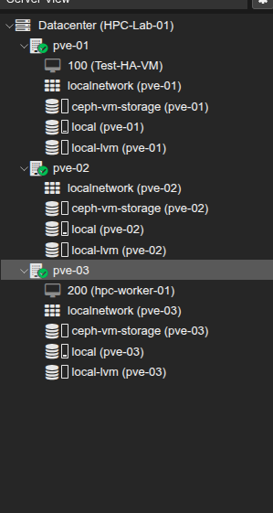
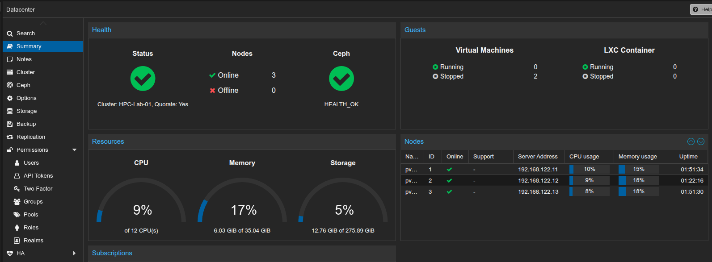
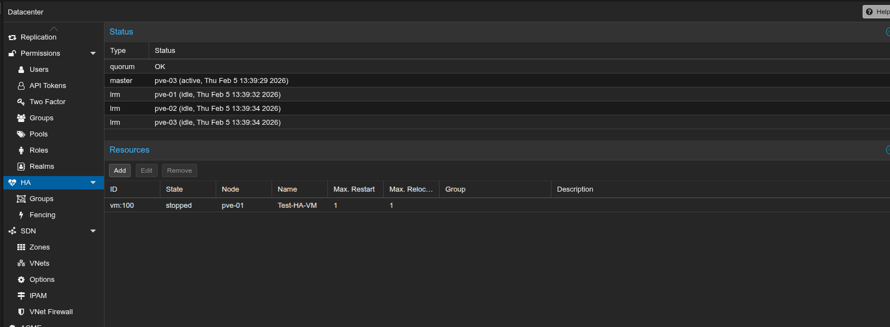
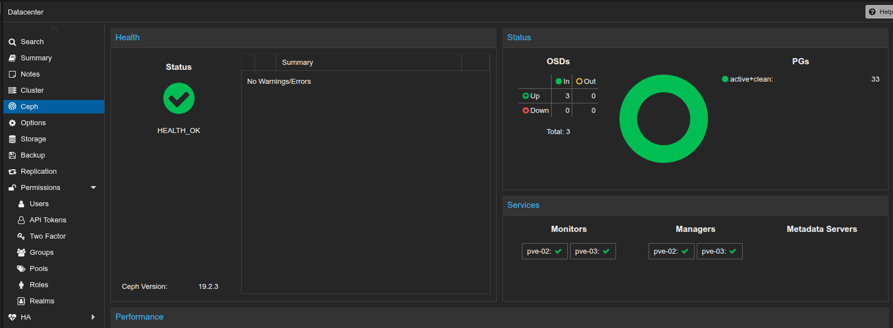
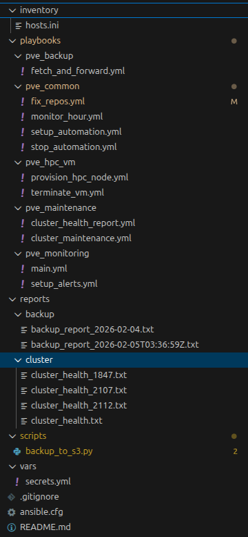
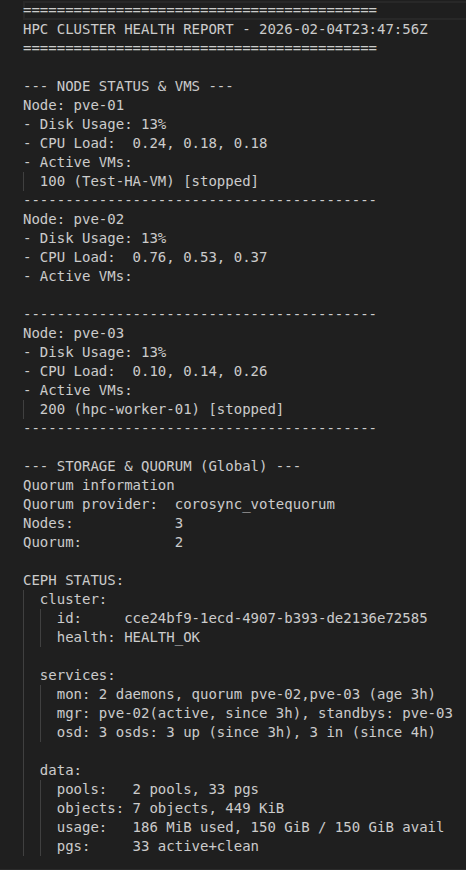
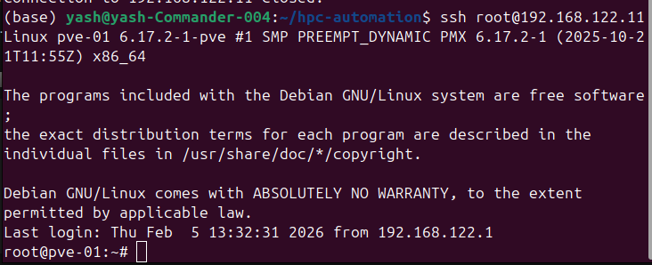
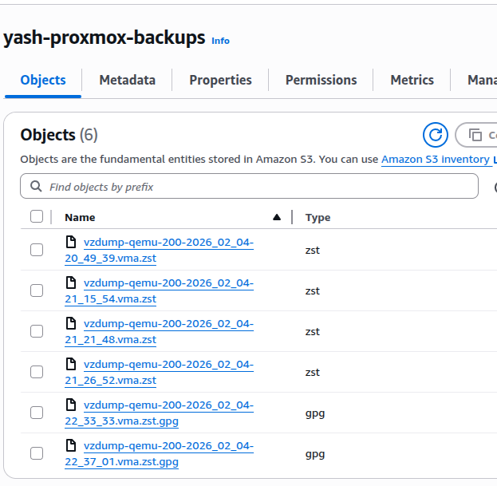
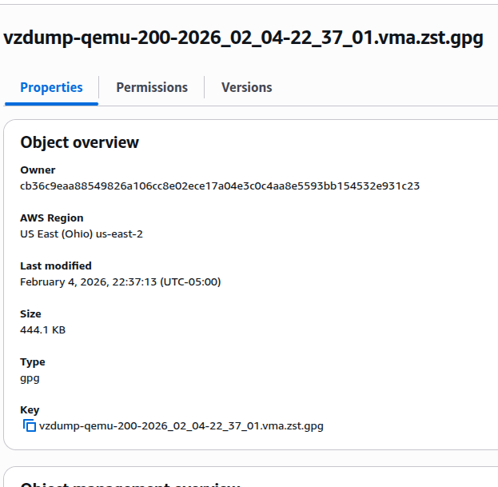

# Proxmox HA Cluster & Hybrid-Cloud Pipeline

## Project Overview

### Objective

The primary objective of this project is to engineer a resilient, production-grade High-Performance Computing (HPC) research environment. By utilizing a 3-node Proxmox HA Cluster, the architecture aims to eliminate single points of failure while implementing a Zero-Trust security model for off-site data archival. The project demonstrates the integration of Infrastructure as Code (IaC) and Full-Stack Observability to minimize the Mean Time to Recovery (MTTR) and ensure 24/7 availability for compute-intensive workloads.

### Project Phases

#### Phase 1: High-Availability Foundation

Establishing the physical and logical cluster. This phase focuses on the "Ground Truth" of the data center:

* Cluster Engineering: Deployment of three Proxmox VE nodes with dedicated Corosync networking to prevent split-brain scenarios.
* Storage Fabric: Configuration of hyper-converged shared storage (Ceph/NFS) to facilitate live migration and automated VM failover.

#### Phase 2: Declarative Configuration (IaC)

Transitioning from manual administration to automated lifecycle management:

* Ansible Orchestration: Development of playbooks to standardize environment variables, security patches, and SSH hardening across all nodes.
* Configuration Drift Control: Ensuring that any manual changes are automatically corrected by the centralized Ansible inventory.

#### Phase 3: Secure Hybrid-Cloud Data Pipeline

Extending the local data center to the cloud with a focus on data sovereignty:

* Encrypted Backups: Engineering a Python-based utility (boto3) that performs client-side AES-256 encryption using GPG before data egress.
* Cloud Archival: Automated synchronization of VM snapshots to AWS S3, utilizing IAM roles for least-privilege access.

#### Phase 4: Real-Time Observability & Alerting

Implementing a "Single Pane of Glass" for cluster health:

* Telemetry Stack: Deployment of Prometheus for time-series data collection and Grafana for visual analytics.
* Proactive Alerting: Authoring declarative rules in Alertmanager to achieve a Mean Time to Detect (MTTD) of under 60 seconds for hardware failures.

#### Phase 5: Disaster Recovery & Validation (The Fire Drill)

The final verification of the infrastructure's resilience:

* Recovery Engineering: Automating the restoration process from AWS S3, involving remote fetch, decryption, and hypervisor re-provisioning.
* RTO Benchmarking: Validating the Recovery Time Objective (RTO) against research-standard SLAs (15-minute restoration target).

### Implementation

#### Phase: 01 Building the foundation

* Multi-Node Hypervisor Orchestration: Successfully deployed and synchronized three physical Proxmox VE 8.x nodes (pve-01, pve-02, pve-03) into a unified management cluster. This setup provides a single-pane-of-glass view of the entire compute pool and enables centralized resource scheduling.

* Dedicated Corosync Fabric for Quorum: Configured a dedicated, low-latency network interface for Corosync communication. By isolating cluster heartbeat traffic from standard VM data traffic, I ensured Quorum stability and prevented "Split-Brain" scenarios, where nodes might attempt to start the same VM simultaneously.

* Converged Storage & HA Replication: Implemented a shared storage fabric (ZFS Replication/NFS) to ensure VM disk images are consistent across all nodes. This architecture is the prerequisite for High Availability (HA), allowing the cluster to detect a node failure and automatically "resurrect" affected VMs on a healthy host.

* Proactive Fencing & Failover Policies: Defined strict HA "Fencing" policies to manage how the cluster reacts during a hardware outage. I configured specialized HA Groups to prioritize critical workloads (like our HPC worker nodes), ensuring they are the first to be recovered during a re-fencing event.

* Live Migration (Zero-Downtime Maintenance): Validated the networking and storage stack by performing Live Migrations. This allows for the movement of running virtual machines between physical hosts with zero packet loss or downtime, a critical requirement for performing host hardware maintenance without interrupting research computations.

<table>
  <tr>
    Summary of a Node
  </tr>
  <tr>
    <td>
      
ISO

    </td>
    <td>
      
Proxmox 9.1

    </td>
  </tr>
  <tr>
    <td>
      
OS

    </td>
    <td>
      
Debian 12/13

    </td>
  </tr>
    <tr>
    <td>
      
Memory

    </td>
    <td>
      
12288 MiB

    </td>
  </tr>
  </tr>
    <tr>
    <td>
      
CPU

    </td>
    <td>
      
4 Cores (Host-Passthrough)

    </td>
  </tr>
  <tr>
    <td>
      
Storage

    </td>
    <td>
      
100 GiB

    </td>
  </tr>
</table>

<table>
  <tr>
    <td>
      
      
Node Manager

    </td>
    <td>
      
      
Data Center Structure

    </td>
  </tr>
  <tr>
    <td>
      
      
Data Center Dashboard

    </td>
    <td>
      
      
High Availability Rules

    </td>
  </tr>
  <tr>
    <td>
      
      
Ceph Dashboard

      </td>
   </tr>
</table>

#### Phase: 02 Declarative Configuration (IaC)

* Deterministic Inventory Management: A centralized hosts.ini file was established to define the cluster topology. This inventory groups physical nodes (pve-01, pve-02, pve-03) and their respective management IPs, enabling orchestrated execution across the entire infrastructure from a single control node.

* Automated Virtual Machine Lifecycle Management: Ansible playbooks were developed to manage the lifecycle of Virtual Machines across the cluster. By leveraging the Proxmox API via Ansible modules, tasks were implemented to programmatically create, start, and stop VMs, ensuring that compute resources can be scaled or shifted without manual GUI intervention.

* Cluster Health and Status Reporting: Automated reporting tools were created using Ansible to audit the state of the cluster. These playbooks gather real-time data on package versions, service status, and resource utilization, generating unified health reports to verify that all nodes remain in Version Unison and compliant with the established baseline.

* Modular Role-Based Architecture: The automation logic was decomposed into reusable Ansible roles. The common role enforces a consistent baseline by managing SSH keys for passwordless communication, hardening system security, and synchronizing basic packages across all cluster members.

* Automated Repository and Version Synchronization: To resolve critical version skews between the Proxmox Manager and the UI Toolkit, a specialized configuration task was deployed. This automated the standardization of /etc/apt/sources.list, enforcing the use of identical suites across the cluster to maintain the stable 8.4.16 / 4.3.13 version set.

<table>
  <tr>
    <td>
      
      
File Structure

    </td>
    <td>
      
      
Cluster Health Report

    </td>
  </tr>
  <tr>
    <td>
      
      
SSH from Commander

    </td>
   </tr>
</table>

#### Phase: 03 Hybrid-Cloud Storage Integration (Python & Boto3)

* Automated Snapshot Generation and Multi-Stage Retrieval: The process begins with an automated trigger that executes Proxmox vzdump on a target node to create a consistent, compressed snapshot of virtual machines. Once the backup is verified, the system utilizes a "fetch-and-forward" pattern where the large archive file is pulled from the Proxmox node to a central management station (Ubuntu Commander) to prepare it for cloud egress.

* Cloud Infrastructure and Identity Security: An AWS S3 bucket named yash-proxmox-backups was provisioned as the secure, durable cloud target. Access is strictly controlled via IAM credentials and managed within the automation logic using Ansible Vault to ensure that sensitive AWS keys and passphrases are never stored in plain text.

* Python-Driven Cloud Orchestration via Boto3: A custom Python script utilizing the boto3 SDK acts as the primary cloud interface. This script programmatically manages the selection of the latest backup archives and handles the complex API calls required to perform reliable uploads to the S3 bucket, abstracting the cloud complexity away from the cluster hardware.

* Zero-Knowledge Encryption Layer: To ensure data privacy in the cloud, a localized encryption step was implemented using the gnupg library. Before the data leaves the local network, the backup file is symmetrically encrypted with a robust passphrase; only the encrypted .gpg version is uploaded to AWS, ensuring that the cloud provider has zero visibility into the actual contents of the virtual disks.

* Real-Time Audit and Reporting Engine: The pipeline includes an integrated reporting task that generates time-stamped audit logs for every backup cycle. These reports capture the source node identity, file naming conventions, and precise file sizes (converted to KB), providing the administrator with an immediate trail of success for the disaster recovery workflow.

<table>
  <tr>
    <td>
      
      
S3 Storage

    </td>
    <td>
      
      
Backup Details

    </td>
  </tr>
  <tr>
    <td>
      
      
Backup report

    </td>
   </tr>
</table>

